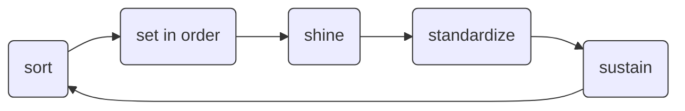

# Summary: 5S for Bioinformatic Workflows

::left::

- **Sort**
  - Define and isolate workflow steps
- **Set-in-order**
  - Separate data analysis logic from the actual data
  - Parameterize your scripts
  - Modularize your code
- **Shine**
  - Record tool dependencies
  - Specify resource requirements
  - Use semantics for metadata annotation
  - Attribute authors and contributors
- **Standardize**
  - Uncouple processes from the execution environment
  - Use containers
- **Sustain**
  - Publish and (re)integrate your workflow / step

::right::

