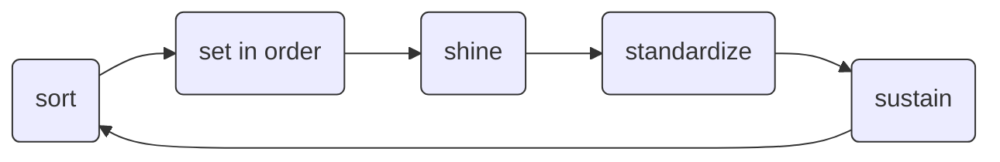

## The 5S methodology for workplace development

#### Goal: Organizing a work space for efficiency and effectiveness

::left::

### Japanese original

- seiri (整理) 
- seiton (整頓)
- seisō (清掃)
- seiketsu (清潔)
- shitsuke (躾)

::right::

### Rough translation

<Footnotes>
  <Footnote>
  
   Ho SK, Cicmil S, Fung CK (1995), "The Japanese 5‐S practice and TQM training". 
   Training for Quality, Vol. 3 No. 4 pp. 19–24, doi: https://doi.org/10.1108/09684879510098222

  </Footnote>
</Footnotes>