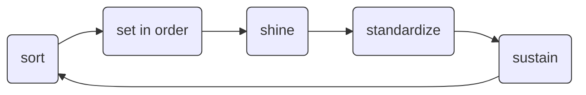

## R- und S-Sätze

„Risiko- und Sicherheitssätze“
(English: risk and safety)

<div style="display:flex; gap:1rem; flex-wrap:nowrap; align-items:center;">
  
  
  
</div>

*Nowadays replaced by the hazard (H-) and precautionary (P-) statements*

---
layout: default
---

## The many Rs that the R in FAIR<sup>1</sup> could stand for (in workflow context)
 
- Replicable
- Reproducible
- Reliable
- Referable
- Routine
- Rapid
- Robust
- Reconfigurable

<v-click>

- **Reusable**

<Footnotes>
  <Footnote :number=1>
   FAIR = Findable | Accessible | Interoperable | Reusable
  </Footnote>
</Footnotes>

</v-click>

---
layout: two-columns
---

## The 5S methodology for workplace development

#### Goal: Organizing a work space for efficiency and effectiveness

::left::

### Japanese original

- seiri (整理) 
- seiton (整頓)
- seisō (清掃)
- seiketsu (清潔)
- shitsuke (躾)

::right::

### Rough translation




<Footnotes>
  <Footnote>
  
   Ho SK, Cicmil S, Fung CK (1995), "The Japanese 5‐S practice and TQM training".<br>
   Training for Quality, Vol. 3 No. 4 pp. 19–24, doi: https://doi.org/10.1108/09684879510098222

  </Footnote>
</Footnotes>


---
layout: default
---

## **Sort** – Define and isolate workflow steps

- A workflow step should ideally perform only one distinct task
- Avoid mixing (unrelated) processes in a single step
- This improves:
  - Reusability across projects
  - Understandability
  - Clarity around inputs and outputs

---
layout: two-columns
---

## **Sort** – Break into reusable steps

::left::

```yaml [my-fancy-all-in-one-pipeline.py]
import sys
import pandas as pd
import matplotlib.pyplot as plt
import seaborn as sns

# Sort data
data = pd.read_csv("data.csv")
data_sorted = data.sort_values(by=data.columns[0])
data_sorted.to_csv("sorted.csv", index=False)

# Plot heatmap
sns.heatmap(data_sorted, cmap="viridis", cbar=True)
plt.title("Heatmap of sorted numeric columns")
plt.savefig("heatmap.png", dpi=150)

# More steps...
...
```

::right::

**My fancy all-in-one cloning protocol (in elabFTW)**

1. Run PCR
2. Ligate plasmid
3. Transform into E. coli
4. Plate on agar
6. Miniprep
7. Sequence verification
8. Analyze results
9. ...

---
layout: two-columns
---

## Step by step

::left::

```yaml [my-fancy-all-in-one-pipeline.py]
import sys
import pandas as pd
import matplotlib.pyplot as plt
import seaborn as sns

# Sort data
data = pd.read_csv("data.csv")
data_sorted = data.sort_values(by=data.columns[0])
data_sorted.to_csv("sorted.csv", index=False)

# Plot heatmap
sns.heatmap(data_sorted, cmap="viridis", cbar=True)
plt.title("Heatmap of sorted numeric columns")
plt.savefig("heatmap.png", dpi=150)

# More steps...
...
```

::right::

```python [sort-csv.py]
import sys
import pandas as pd

# Sort data
data = pd.read_csv("data.csv")
data_sorted = data.sort_values(by=data.columns[0])
data_sorted.to_csv("sorted.csv", index=False)
```

```python [heatmap.py]
# Plot heatmap
import sys
import pandas as pd
import matplotlib.pyplot as plt
import seaborn as sns

data = pd.read_csv("sorted.csv")
sns.heatmap(data_sorted, cmap="viridis", cbar=True)
plt.title("Heatmap of sorted numeric columns")
plt.savefig("heatmap.png", dpi=150)
```

---
default: layout
---

## **Set-in-order**: Separate data analysis logic from the actual data
    
- Avoid hard-coded paths or filenames
- Parameterize inputs, outputs, and configuration as arguments
- This improves:
  - Reuse across datasets and platforms
  - Smoother integration into larger workflows or pipelines

---
layout: two-columns
---

## Refactor the script

::left::

Identify `inputs` and `outputs` 

```python 
import sys
import pandas as pd

data = pd.read_csv("data.csv")
data_sorted = data.sort_values(by=data.columns[0])
data_sorted.to_csv("sorted.csv", index=False)
```

<v-click>

Move input and output variables to its own section

```python 
import sys
import pandas as pd

input_file = "data.csv"
output_file = "sorted.csv"

data = pd.read_csv(input_file)
data_sorted = data.sort_values(by=data.columns[0])
data_sorted.to_csv(output_file, index=False)
```

</v-click>

::right::

<v-click>

**Replace hard-coded paths** with CLI arguments

```python [sort-csv.py]
import sys
import pandas as pd

input_file = sys.argv[1]
output_file = sys.argv[2]

data = pd.read_csv(input_file)
data_sorted = data.sort_values(by=data.columns[0])
data_sorted.to_csv(output_file, index=False)
```

run via CLI

```bash
python sort-csv.py data.csv sorted.csv
```

</v-click>


---
layout: two-columns
---

## CWL-wrap your "step"

::left::

```python [sort-csv.py]
import sys
import pandas as pd

input_file = sys.argv[1]
output_file = sys.argv[2]

data = pd.read_csv(input_file)
data_sorted = data.sort_values(by=data.columns[0])
data_sorted.to_csv(output_file, index=False)
```

::right::

Wrap a script as a CWL `CommandLineTool`:  
`sort-csv.cwl` 

```yaml{*}{maxHeight:'300px'}
cwlVersion: v1.2
class: CommandLineTool
requirements:
  - class: InitialWorkDirRequirement
    listing:
      - entryname: sort-csv.py
        entry:
          $include: sort-csv.py
baseCommand: [python, sort-csv.py]
inputs:
  input_file:
    type: File
    inputBinding:
      position: 1
  output_filename:
    type: string
    inputBinding:
      position: 2
outputs:
  output_file:
    type: File
    outputBinding:
      glob: $(inputs.output_filename)
```

<!-- <FancyArrow from="(250, 380)" to="(650, 350)" arc="-0.25" color="#186EC0"/> -->

This basically runs

```bash
python sort-csv.py data.csv sorted.csv
```

---
layout: two-columns
---

## Build a multi-step workflow

::left::

`sort-csv.cwl` 

```yaml{*}{maxHeight:'140px'}
cwlVersion: v1.2
class: CommandLineTool
requirements:
  - class: InitialWorkDirRequirement
    listing:
      - entryname: sort-csv.py
        entry:
          $include: sort-csv.py
baseCommand: [python, sort-csv.py]
inputs:
  input_file:
    type: File
    inputBinding:
      position: 1
  output_filename:
    type: string
    inputBinding:
      position: 2
outputs:
  output_file:
    type: File
    outputBinding:
      glob: $(inputs.output_filename)
```

`heatmap.cwl`

```yaml{*}{maxHeight:'140px'}
cwlVersion: v1.2
class: CommandLineTool
requirements:
  - class: InitialWorkDirRequirement
    listing:
      - entryname: heatmap.py
        entry:
          $include: heatmap.py
baseCommand: [python, heatmap.py]
inputs:
  input_file:
    type: File
    inputBinding:
      position: 1
  output_filename:
    type: string
    inputBinding:
      position: 2
outputs:
  output_file:
    type: File
    outputBinding:
      glob: $(inputs.output_filename)
```

::right::

```yaml [workflow.cwl]
cwlVersion: v1.2
class: Workflow

inputs:
  input_file: File
  out_heatmap: string

steps:
  step1:
    run: sort-csv.cwl
    in:
      input_file: input_file
      output_filename: output_filename
    out: [output_file]
  step2:
    run: heatmap.cwl
    in:
      in_sorted: step1/output_file
      output_filename: out_heatmap
    out: [output_file]

...
```

<AdmonitionType type="note" title>
this is not a good example...
</AdmonitionType>


---
layout: two-columns
---

## Bring back the data to the workflow

::left::

```yaml [workflow.cwl]
cwlVersion: v1.2
class: Workflow

inputs:
  input_file: File
  out_heatmap: string

steps:
  step1:
    run: sort-csv.cwl
    in:
      input_file: input_file
      output_filename: output_filename
    out: [output_file]
  step2:
    run: heatmap.cwl
    in:
      in_sorted: step1/output_file
      output_filename: out_heatmap
    out: [output_file]

...
```

::right::

Provide the required parameters

```yaml [my-job.yml]
input_file:
  class: File
  path: data.csv
out_heatmap: heatmap.png
```

Execute with e.g.
```bash
cwltool workflow.cwl my-job.yml
```


---
default: layout
---

## ✨ **Shine** ✨ – Record information about dependencies

- Record the script language (e.g. Python, R, Bash)
- List all external packages, libraries, and software tools used
- Specify versions
- List runtime environments and hardware requirements
- Include useful metadata:
  - Official citations of tools
  - URLs (e.g. docs, GitHub, project websites)
  - Unique identifiers from registries such as 
    - [bio.tools](https://bio.tools/)
    - [RRIDs via SciCrunch](https://scicrunch.org/resources/about/resource)
    - [identifiers.org](https://identifiers.org/)
  - Authors and contributors

---
layout: default
---

## Record tool dependencies

- Python packages (`pandas, version 1.5.3`, `numpy, version 1.23.0`)
- R libraries (`ggplot2`)
- Command-line tools (`samtools`, `awk`)
- ...

### Conventions for different languages

- Python:
  - pip `requirements.txt`
  - conda `environment.yml`
- R: renv, `renv.lock`
- JavaScript: `package.json`, `package-lock.json`
- .NET: `*.csproj`, `*.fsproj`
- ...


---
layout: two-columns
---

## Record tool dependencies

::left::

```python [sort-csv.py]
import sys
import pandas as pd

input_file = sys.argv[1]
output_file = sys.argv[2]

data = pd.read_csv(input_file)
data_sorted = data.sort_values(by=data.columns[0])
data_sorted.to_csv(output_file, index=False)
```

```yaml [requirements.txt]
pandas==1.5.3
```

::right::

```yaml [workflow.cwl]
...
hints:
  SoftwareRequirement
    packages:
      - package: python
        version: [3.10]
        specs: [ https://identifiers.org/rrid/RRID:SCR_008394 ]
      - package: pandas
        version: [1.5.3]
        specs: [ https://identifiers.org/biotools/pandas ]
...
```

- `package:` name of the software or package
- `version:` version of the software or package
- `specs:` a reference URL for the software or package (e.g. from [bio.tools](https://bio.tools) or [SciCrunch](https://identifiers.org/rrid/))

---
layout: two-columns
---

## Example: CWL + Conda (beta)

::left::

```yml{*}{maxHeight:'400px'}
cwlVersion: v1.2
class: CommandLineTool
requirements:
  - class: InitialWorkDirRequirement
    listing:
      - entryname: sort-csv.py
        entry:
          $include: sort-csv.py
hints:
  SoftwareRequirement
    packages:
      - package: python
        version: [3.10]
        specs: [ https://identifiers.org/rrid/RRID:SCR_008394 ]
      - package: pandas
        version: [1.5.3]
        specs: [ https://identifiers.org/biotools/pandas ]
baseCommand: [python, sort-csv.py]
inputs:
  input_file:
    type: File
    inputBinding:
      position: 1
  output_filename:
    type: string
    inputBinding:
      position: 2
outputs:
  output_file:
    type: File
    outputBinding:
      glob: $(inputs.output_filename)
```


```bash
cwltool --beta-conda-dependencies workflow.cwl
```

::right::

<AdmonitionType type="tip">

With conda and cwltool installed, this can be run directly. No need for tool installation.

</AdmonitionType>

<AdmonitionType type="warning">

Running it like this will locally install the conda dependencies (~2.5GB) parallel to the `workflow.cwl`

Check out
  - `--beta-dependency-resolvers-configuration`
  - `--beta-dependencies-directory`

</AdmonitionType>


---
layout: two-columns
---

## Specify resource requirements

::left::

PBS `qsub` job script

```bash [qsub.sh]{2}
#!/bin/bash
#PBS -l select=1:ncpus=3:mem=1000mb

set -e

module load blastx

blastx ...

...

```

::right::

<v-click>

`ResourceRequirement` allows to specify the required compute resources


```yaml [workflow.cwl]{5-7}
cwlVersion: v1.2
class: CommandLineTool
hints:
  ResourceRequirement:
    coresMin: 3
    ramMin: 1000

baseCommand: [blastx]

inputs: []

outputs: []
```

</v-click>


---
layout: two-columns
---

## Example: Toil-Runner translates your CWL to HPC

::bottom::

Docs / installation: https://toil.readthedocs.io/en/latest/gettingStarted/install.html

::left::

```bash
source ~/venv/bin/activate
module load Python/3.12.3

export TOIL_TORQUE_ARGS="-A <MyProjectName>"
export TOIL_TORQUE_REQS="walltime=01:59:00"

toil-cwl-runner \
  --batchSystem torque \
  --jobStore job-store \
  --retryCount 0 \
   workflow.cwl run.yml
```

::right::

```yml [run.yml]
message: Hello world!
```

```yml [workflow.cwl]
cwlVersion: v1.2
class: CommandLineTool
baseCommand: echo
stdout: output.txt
inputs:
  message:
    type: string
    inputBinding:
      position: 1
outputs:
  output:
    type: stdout
```


---
layout: default
---

## Use semantics for metadata annotation

Adding namespaces and schemas allows to reuse them elsewhere in a CWL document

`workflow.cwl`

```yaml 
...
$namespaces:
  s: https://schema.org/
  edam: https://edamontology.org/

$schemas:
  - https://schema.org/version/latest/schemaorg-current-https.rdf
  - https://edamontology.org/EDAM_1.18.owl
...
```

---
layout: default
---

## Attribute authors and contributors

`workflow.cwl`

```yaml 
...
s:author:
  - class: s:Person
    s:identifier: https://orcid.org/0000-0001-9021-3197
    s:email: mailto:brilhaus@hhu.de
    s:name: Dominik Brilhaus

s:contributor:
  - class: s:Person
    s:identifier: <contributor ORCID>
    s:email: mailto:<contributor email>
    s:name: <contributor name>
...
$namespaces:
  s: https://schema.org/
...
```


---
default: layout
---

## **Standardize** – Uncouple processes from the execution environment

- Ensure that your analysis can be run anywhere on "defined types of data"
- Use containerization (e.g., Docker, Singularity) to bundle:
  - Dependencies
  - Correct versions
  - Required system tools
- Use existing community-maintained containers where possible, e.g.
  - [BioContainers](https://biocontainers.pro/)
  - [Docker Hub](https://hub.docker.com/)
- This makes your analysis portable and reproducible across different systems

---
layout: default
---

## Add a container

Use the `DockerRequirement` to load a published Docker image


```yaml [workflow.cwl]
...
requirements:
  - class: DockerRequirement
    dockerPull: python:3.10-slim
...
```


---
layout: default
---

## Example: CWL + Docker + FastQC


```yaml [workflow.cwl] {5-7}
#!/usr/bin/env cwl-runner
cwlVersion: v1.2
class: CommandLineTool

hints:
  DockerRequirement:
    dockerPull: quay.io/biocontainers/fastqc:0.11.9--hdfd78af_1

baseCommand: ["fastqc", "--help"]

inputs: []
 
outputs: []
```

With Docker and cwltool installed, this can be run directly. No need for tool installation.

```bash
cwltool workflow.cwl
```

---
layout: default
---

## Reference a local `Dockerfile`

If no suitable container is available, you can add your own `Dockerfile` 

```dockerfile [Dockerfile]
FROM python:3.10-slim
RUN pip install pandas==1.5.3
```

```yaml [workflow.cwl]
...
hints:
  DockerRequirement:
    dockerImageId: "mydocker"
    dockerFile: {$include: "Dockerfile"}
...
```

---
layout: two-columns
---

<!-- TODO File hand-over -->

## Specify file types for inputs and outputs

::left::

```yaml [workflow.cwl]
...
inputs:
  input_file:
    type: File
    format: edam:format_3752  # CSV format
...
outputs:
  output_file:     
    type: File
    format: edam:format_3603  # PNG format
...
$namespaces:
  edam: https://edamontology.org/
...
```

::right::

- https://edamontology.org/format_3752
- https://edamontology.org/data_2572


---
layout: default
---

## Homework done 🤓

```yaml{*}{maxHeight:'800px'}
#!/usr/bin/env cwl-runner
cwlVersion: v1.2
class: CommandLineTool

label: Kallisto quant
doc: |

  Docs: https://pachterlab.github.io/kallisto/

  Computes equivalence classes for reads and quantifies abundances

  Usage: kallisto quant [arguments] FASTQ-files

  Required arguments:
  -i, --index=STRING            Filename for the kallisto index to be used for
                                quantification
  -o, --output-dir=STRING       Directory to write output to

  Optional arguments:
  -b, --bootstrap-samples=INT   Number of bootstrap samples (default: 0)
      --seed=INT                Seed for the bootstrap sampling (default: 42)
      --plaintext               Output plaintext instead of HDF5
      --single                  Quantify single-end reads
      --single-overhang         Include reads where unobserved rest of fragment is
                                predicted to lie outside a transcript
      --fr-stranded             Strand specific reads, first read forward
      --rf-stranded             Strand specific reads, first read reverse
  -l, --fragment-length=DOUBLE  Estimated average fragment length
  -s, --sd=DOUBLE               Estimated standard deviation of fragment length
                                (default: -l, -s values are estimated from paired
                                end data, but are required when using --single)
  -p, --priors                  Priors for the EM algorithm, either as raw counts or as
                                probabilities. Pseudocounts are added to raw reads to
                                prevent zero valued priors. Supplied in the same order
                                as the transcripts in the transcriptome
  -t, --threads=INT             Number of threads to use (default: 1)
      --verbose                 Print out progress information every 1M proccessed reads


  This CWL was adapted from: https://github.com/common-workflow-library/bio-cwl-tools/commit/91c42fb809ce18eafe16155cca0abf362270c0fe


hints:
  DockerRequirement:
    dockerPull: quay.io/biocontainers/kallisto:0.51.1--ha4fb952_1
  SoftwareRequirement:
    packages:
      - package: kallisto
        version: [ "0.51.1" ]
        specs: [ https://identifiers.org/biotools/kallisto ]

inputs:
  InputReads:
    type: File[]
    format: edam:format_1930  # FASTQ
    inputBinding:
      position: 200

  QuantOutfolder: 
    type: string

  Index:
    type: File
    inputBinding:
      position: 1
      prefix: "--index"

  isSingle:
    type: boolean
    inputBinding:
      position: 2
      prefix: "--single"

  #Optional Inputs

  isBias:
    type: boolean?
    inputBinding:
      prefix: "--bias"

  isFusion:
    type: boolean?
    inputBinding:
      prefix: "--fusion"

  isSingleOverhang:
    type: boolean?
    inputBinding:
      prefix: "--single-overhang"
  
  FragmentLength:
    type: double?
    inputBinding:
      separate: false
      prefix: "--fragment-length="
  
  StandardDeviation:
    type: double?
    inputBinding:
      prefix: "--sd"
  
  BootstrapSamples:
    type: int?
    inputBinding:
      separate: false
      prefix: "--bootstrap-samples="
  
  Seed:
    type: int?
    inputBinding:
      prefix: "--seed"

#Using record inputs to create mutually exclusive inputs
  Strand:
    type:
      - "null"
      - type: record
        name: forward
        fields:
          forward:
              type: boolean
              inputBinding:
                prefix: "--fr-stranded"

      - type: record
        name: reverse
        fields:
          reverse:
            type: boolean
            inputBinding:
              prefix: "--rf-stranded"

  PseudoBam:
    type: boolean?
    inputBinding:
      prefix: "--pseudobam"

#Using record inputs to create dependent inputs
  
  GenomeBam:
    type:
      - "null"
      - type: record
        name: genome_bam
        fields:
          genomebam:
            type: boolean
            inputBinding:
              prefix: "--genomebam"

          gtf:
            type: File
            inputBinding:
              prefix: "--gtf"

          chromosomes:
            type: File
            inputBinding:
              prefix: "--chromosomes"

baseCommand: [ kallisto, quant ]

arguments: [ "--output-dir", $(inputs.QuantOutfolder) ]

outputs:

  kallistoQuantOutDir:
    type: Directory
    outputBinding:
      glob: $(runtime.outdir)/$(inputs.QuantOutfolder)


$namespaces:
  edam: https://edamontology.org/
  s: https://schema.org/
$schemas:
  - https://edamontology.org/EDAM_1.25.owl
  - https://schema.org/version/latest/schemaorg-current-https.rdf
```

https://git.nfdi4plants.org/brilator/Facultative-CAM-in-Talinum/-/blob/main/workflows/kallisto/kallisto-quant.cwl


---
layout: default
---

## SciWIn – Scientific Workflow Infrastructure

https://github.com/fairagro/m4.4_sciwin_client


<Footnotes>
  <Footnote>
  Adapted from: Krumsieck, J., Leidel, A., Stiensmeier, X., & von Waldow, H. (2025). FAIR, fast, and frictionless – <br> computational workflows with SciWIn. Data Days Niedersachsen 2025, Braunschweig. Zenodo. https://doi.org/10.5281/zenodo.17651648

  </Footnote>
</Footnotes>

---
layout: default
---

## **Sustain** – Share and maintain your workflow (step)


- Provide docs and examples
- Use version control 
- Publish your workflow e.g.
  - GitHub, GitLab
  - Dockstore https://dockstore.org
  - WorkflowHub https://workflowhub.eu

---
layout: default
---

<div class="text-sm">

## Public workflows 

### CWL

- search `language:"Common Workflow Language" kallisto` on GitHub
- Published CWL Workflows: https://view.commonwl.org/workflows
- Bio-cwl-tools: https://github.com/common-workflow-library/bio-cwl-tools/

### Nextflow

- https://github.com/nf-core

### Galaxy

- IWC (Intergalactic Workflow Commission): https://github.com/galaxyproject/iwc (best-practices workflows)
- https://usegalaxy.eu/workflows/list_published

### Snakemake

- https://snakemake.github.io/snakemake-workflow-catalog/index.html

</div>

---
layout: default
---


## WorkflowHub

- **FAIR registry** for describing, sharing and publishing scientific computational workflows
- Supports multiple workflow languages  
- Provides metadata, versioning, and citation info  
- Facilitates discovery and re-use of workflows in an accessible and interoperable way
- Encourages **reusability** and **collaboration**
- extensive use of **open standards and tools**:
  - [CWL](https://www.commonwl.org/)
  - [RO-Crate](https://www.researchobject.org/ro-crate/)
  - [Bioschemas](https://bioschemas.org/)

<div class="absolute top-20 left-230">
  
  <a class="text-xs text-gray-400" target="_blank" href="https://workflowhub.eu/">https://workflowhub.eu</a>
</div>


---
layout: default
---


## **Sustain** – Publish and (re)integrate your workflow / step

