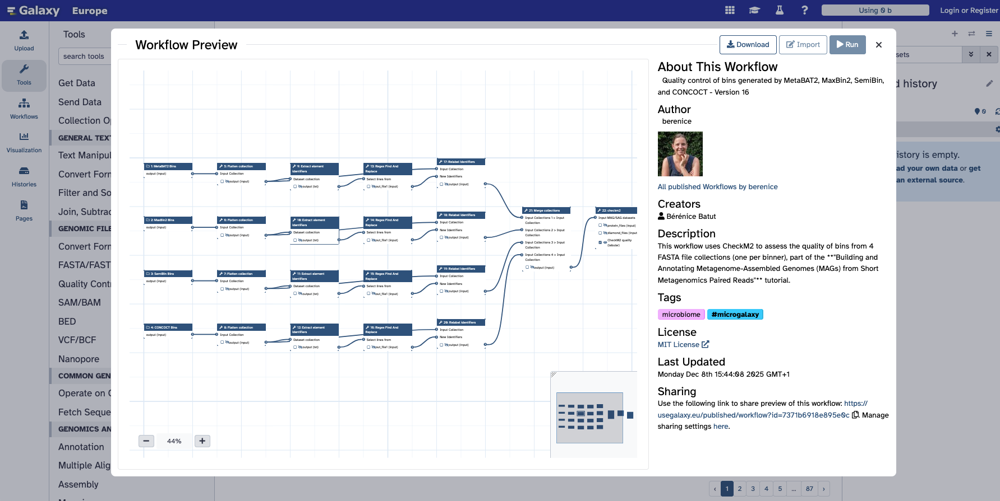

# Galaxy

    
  <a class="text-xs text-gray-400" target="_blank" href="https://usegalaxy.eu/">https://usegalaxy.eu/</a>

- Web-based, GUI platform for workflow design and execution
- Visual drag-and-drop workflow builder
- Integrates with CWL, Nextflow, Snakemake

- https://galaxyproject.org
- EU: https://usegalaxy.eu
- Plants: https://plants.usegalaxy.eu

---
layout: default
---

## Galaxy Workflow Editor

https://usegalaxy.eu/workflows/list_published

<!-- TODO

## Galaxy

 - example workflow figure
  - and corresponding .ga file
 -->

---
layout: default
---

## The Cloud-based Workflow Manager (CloWM /klaʊm/)

https://clowm.bi.denbi.de

Workflows: https://clowm.bi.denbi.de/workflows